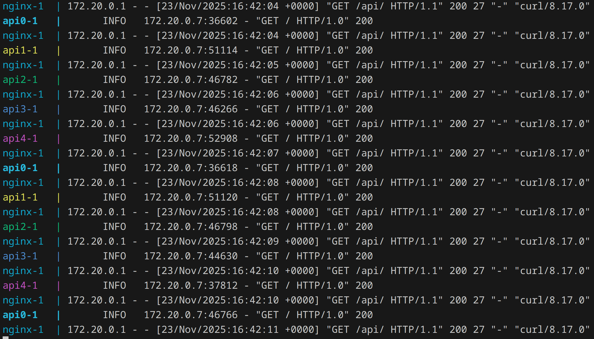

# Basic Nginx Load Balancing



## Architecture
- FastAPI App
- Nginx
- Docker Compose

## Load Balancing Method
The system uses **round-robin** load balancing by default. This means:
- Incoming requests are distributed sequentially across all available backend servers
- Each new request goes to the next server in the list
- When the end of the list is reached, it starts again from the beginning

## Steps to launch
- Build Docker images
    - Nginx
    ```bash
    cd nginx/

    docker build -t app-nginx .
    ```

    - FastAPI App
    ```bash
    cd app/

    docker build -t app .
    ```

- Run Docker Compose
    ```bash
    docker compose up --build
    ```

## Access the application

```bash
curl http://localhost:8080/api/
```
